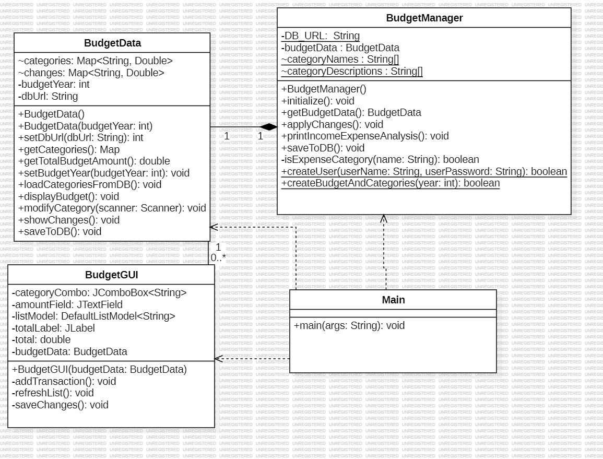

# PrimeMinisterForADay-Πρωθυπουργός για μία μέρα 
Η εφαρμογή «PrimeMinisterForADay» είναι ένα σύστημα διαχείρισης και ανάλυσης του κρατικού προϋπολογισμού. Παρέχει τη δυνατότητα στον χρήστη να προσομοιώσει αποφάσεις δημοσιονομικής πολιτικής μέσω περιβάλλοντος γραμμής εντολών (CLI) ή γραφικού περιβάλλοντος (GUI). Είναι υλοποιημένη σε Java, χρησιμοποιεί HashMaps για προσωρινή αποθήκευση δεδομένων στη μνήμη και SQLite για μόνιμη αποθήκευση. Μέσω της εφαρμογής ο χρήστης μπορεί να:

   - Εξετάζει και να προβάλλει στοιχεία του προϋπολογισμού (έσοδα, έξοδα, ισοζύγιο).

   - Τροποποιεί υφιστάμενες κατηγορίες ή ποσά.

   - Προσθέτει ή διαγράφει κατηγορίες προϋπολογισμού.

   - Παρακολουθεί αναλυτική κατανομή του προϋπολογισμού και σύγκριση πριν και μετά τις αλλαγές.

   - Αποθηκεύει τις αλλαγές στη βάση δεδομένων κατόπιν επιβεβαίωσης.

   - Περιλαμβάνει αυτόματους ελέγχους ορίων προϋπολογισμού και προειδοποιήσεις σε περίπτωση παραβίασης βασικών δημοσιονομικών κανόνων.

## Οδηγίες μεταγλώτισσης του προγράμματος

 1. Εκτελέστε την εντολή: mvn clean package στο terminal. Προϋπόθεση της μεταγλώτισσης του προγράμματος, αποτελεί η εγκατάστηση του προγράμματος Maven.

## Οδηγίες εκτέλεσης του προγράμματος

1. Εκτελέστε την εντολή: `java -jar PrimeMinisterForADay.jar` στο terminal

---
## Οδηγίες Χρήσης

Η εφαρμογή μπορεί να χρησιμοποιηθεί μέσω CLI ή GUI (Swing).  
Ακολουθήστε τα παρακάτω βήματα:

1. **Εμφάνιση διαθέσιμων κατηγοριών**  
   - Δείτε ποιες κατηγορίες προϋπολογισμού μπορείτε να επεξεργαστείτε.

2. **Επιλογή κατηγορίας**  
   - Επιλέξτε την επιθυμητή κατηγορία για τροποποίηση.

3. **Εισαγωγή ποσού ή ποσοστού**  
   - Εισάγετε χρηματικό ποσό σε ευρώ ή ποσοστό για την επιλεγμένη κατηγορία.

4. **Προσθήκη/Διαγραφή κατηγοριών**  
   - Προσθέστε νέα κατηγορία ή διαγράψτε υπάρχουσα, αν χρειάζεται.

5. **Αναλυτική προβολή και υπολογισμοί**  
   - Δείτε κατανομή προϋπολογισμού ανά κατηγορία.  
   - Το πρόγραμμα υπολογίζει αυτόματα το συνολικό ποσό και το ισοζύγιο (πλεόνασμα/έλλειμμα).

6. **Αυτόματοι έλεγχοι ορίων**  
   - Προειδοποιήσεις σε περίπτωση παραβίασης βασικών δημοσιονομικών κανόνων.

7. **Σύγκριση πριν και μετά**  
   - Προβολή των αλλαγών πριν και μετά την τροποποίηση.  
   - Καταγραφή όλων των ενεργειών σε ιστορικό (log).

8. **Αποθήκευση αλλαγών**  
   - Οι τροποποιήσεις αποθηκεύονται προσωρινά στη μνήμη και γράφονται στη βάση SQLite κατόπιν επιβεβαίωσης.


## Δομή Αποθετηρίου

```text
OmadikiProgr2/
├─ src/
│  ├─ main/
│  │  └─ java/
│  │     └─ PrimeMinisterForADay/
│  │        ├─ BudgetData.java        # Διαχείριση δεδομένων & SQLite CRUD
│  │        ├─ BudgetGUI.java         # Γραφικό περιβάλλον (Swing)
│  │        ├─ BudgetManager.java     # Επιχειρησιακή λογική & έλεγχοι
│  │        └─ Main.java              # Εκκίνηση εφαρμογής (CLI & GUI)
│  └─ test/
│     └─ java/
│        └─ PrimeMinisterForADay/
│           ├─ BudgetDataTest.java
│           ├─ BudgetGUITest.java
│           └─ BudgetManagerTest.java
├─ docs/
│  └─ diagram.png                     # UML διάγραμμα κλάσεων
├─ lib/
│  └─ sqlite-jdbc-3.51.0.0.jar         # JDBC driver για SQLite
├─ PrimeMinisterForADay.jar            # Εκτελέσιμο αρχείο εφαρμογής
├─ pm_for_one_day.db                   # Βάση δεδομένων SQLite
├─ README.md                           # Τεχνική αναφορά / οδηγίες
├─ pom.xml                             # Maven configuration
├─ dependency-reduced-pom.xml          # Παραγόμενο Maven αρχείο
├─ .gitignore
├─ logo.png                            # Λογότυπο εφαρμογής
└─ Documents - Shortcut.lnk            # Συντόμευση (δεν επηρεάζει το project)


## Διάγραμμα UML



## Αλγόριθμοι / Λειτουργίες

Η εφαρμογή βασίζεται σε ένα σύνολο αλγορίθμων που διαχειρίζονται τη ροή δεδομένων, την επιχειρησιακή λογική και τους δημοσιονομικούς ελέγχους:
- Φόρτωση δεδομένων από τη βάση (SELECT) και ενημέρωση τους (UPDATE, INSERT). 
- Προβολή διαθέσιμων κατηγοριών και εισαγωγή αλλαγών (ποσά ή ποσοστά). 
- Προσθήκη ή διαγραφή κατηγοριών. 
- Αυτόματος υπολογισμός συνολικού ποσού και ισοζυγίου (πλεόνασμα / έλλειμμα).
- Αυτόματοι έλεγχοι ορίων προϋπολογισμού και προειδοποιήσεις για παραβίαση δημοσιονομικών κανόνων. 
- Προβολή σύγκρισης πριν και μετά τις αλλαγές και καταγραφή σε ιστορικό (log).
